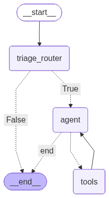

# 📧 Email Assistant

An intelligent AI-powered email assistant built with [LangGraph](https://github.com/langchain-ai/langgraph) that automatically triages incoming emails, generates contextual responses, and manages calendar operations through autonomous tool usage.

## 🌟 Features

- **Intelligent Email Triage**: Automatically classifies emails into `respond`, `notify`, or `ignore` categories
- **Autonomous Response Generation**: Uses GPT-4o to craft contextual, professional email responses
- **Tool Integration**: Seamlessly interacts with email and calendar tools
- **ReAct Pattern**: Implements reasoning and acting loops for complex task handling
- **Memory Management**: Built-in checkpointing for conversation continuity
- **Graph Visualization**: Auto-generates workflow diagrams

## 🏗️ Architecture

The assistant uses a graph-based architecture with the following flow:

```
START → Triage Router → Classification Decision
                ↓
        Should Respond? ──No──→ END
                ↓ Yes
            Agent Node (LLM Reasoning)
                ↓
        Should Continue?
                ↓
        Tools Node ← ──────┐
                ↓          │
        Agent Node ────────┘
                ↓
              END
```

### Key Components

- **Triage Router** (`gpt-4o-mini`): Fast, efficient email classification
- **Agent Node** (`gpt-4o`): Intelligent reasoning and response generation
- **Tool Node**: Executes actions (send emails, schedule meetings, check calendar)
- **Routing Logic**: Conditional edges for dynamic workflow control

## 📦 Installation

### Prerequisites

- Python 3.12 or higher
- OpenAI API key

### Setup

1. **Clone the repository**
   ```bash
   git clone https://github.com/Martin-Robatto/email-assistant-agent.git
   cd email-assistant
   ```

2. **Install dependencies**
   ```bash
   pip install -e .
   ```
   
   Or using `uv`:
   ```bash
   uv sync
   ```

3. **Configure environment variables**
   
   Copy the example environment file and configure your API keys:
   ```bash
   cp .env.example .env
   ```
   
   Then edit `.env` with your credentials:
   ```env
   OPENAI_API_KEY=your_openai_api_key_here
   LANGSMITH_API_KEY=your_langsmith_api_key_here (optional)
   LANGSMITH_TRACING=true (optional)
   LANGSMITH_PROJECT=email-assistant (optional)
   ```

## 🛠️ Available Tools

### Email Tools
- **`write_email`**: Compose and send email responses
  - Parameters: `to`, `subject`, `content`

### Calendar Tools
- **`schedule_meeting`**: Schedule calendar events
  - Parameters: `attendees`, `subject`, `duration_minutes`, `preferred_day`, `start_time`
- **`check_calendar_availability`**: Check available time slots
  - Parameters: `day`

## 📁 Project Structure

```
email_assistant/
├── nodes/              # Graph nodes (triage, agent, tools, routing)
├── prompts/            # LLM prompt templates
├── tools/              # LangChain tool definitions
├── helpers/            # Email parsing and formatting utilities
└── utils/              # State management and LLM configuration
```

For detailed structure documentation, see [`STRUCTURE.md`](STRUCTURE.md).

## 🔧 Configuration

### Model Selection

Models are configured in [`email_assistant/utils/router.py`](email_assistant/utils/router.py):

- **Triage**: `gpt-4o-mini` (fast, cost-effective classification)
- **Agent**: `gpt-4o` (high-quality reasoning and tool calling)

### Customizing Prompts

Edit prompt templates in [`email_assistant/prompts/`](email_assistant/prompts/):
- [`triage_prompts.py`](email_assistant/prompts/triage_prompts.py): Classification instructions
- [`agent_prompts.py`](email_assistant/prompts/agent_prompts.py): Response generation guidelines
- [`defaults.py`](email_assistant/prompts/defaults.py): User background and preferences

### Adding Custom Tools

1. Create tool in [`email_assistant/tools/`](email_assistant/tools/)
2. Export in [`email_assistant/tools/__init__.py`](email_assistant/tools/__init__.py)
3. Add to tools list in [`email_assistant/nodes/tool_node.py`](email_assistant/nodes/tool_node.py)

## 🎯 Email Classification

The triage system categorizes emails into three types:

- **`respond`**: Requires a response (forwarded to agent)
- **`notify`**: Important but no response needed (logged)
- **`ignore`**: Low priority or spam (discarded)

## 🔄 ReAct Loop

The agent uses a Reasoning and Acting (ReAct) pattern:

1. **Reason**: Analyze the email and decide on actions
2. **Act**: Execute necessary tools (send email, check calendar)
3. **Observe**: Review tool results
4. **Repeat**: Continue until task is complete

## 🧪 Development

### Running Tests

```bash
pytest
```

### Code Formatting

```bash
black .
```

### Generating Graph Visualization

The graph is automatically saved to [`graph.png`](graph.png) when the agent is initialized.

## 📊 Graph Visualization



## 🤝 Contributing

Contributions are welcome! Please feel free to submit a Pull Request.

## 🙏 Acknowledgments

Built with:
- [langchain-ai](https://github.com/langchain-ai/agents-from-scratch)

---

**Note**: This is a demonstration project. The email and calendar tools use placeholder implementations. For production use, integrate with actual email (SMTP, IMAP) and calendar (Google Calendar, Outlook) APIs.